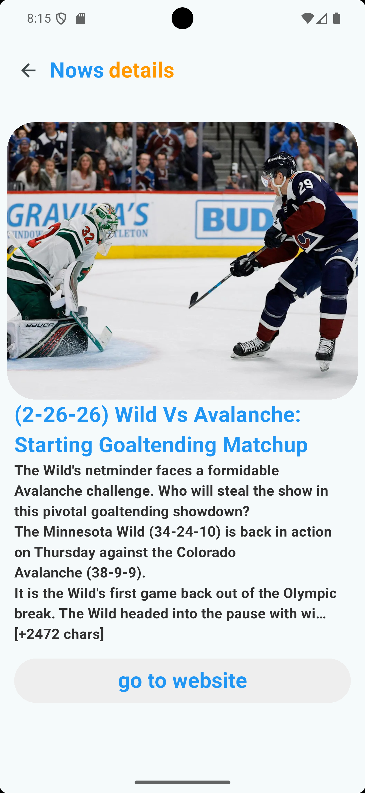

# 📰 News App – Flutter

  
  
  

A modern News Application built with Flutter using clean architecture principles and scalable state management.

🔗 **Repository:**  
https://github.com/Abdalah-eslam/news_app  

---

## 🚀 Overview

This project is a production-style news application that fetches real-time news from a RESTful API and displays trending and latest articles with a clean and responsive UI.

The main focus of this project was:

- Writing clean, maintainable code  
- Applying proper state management  
- Structuring the app using scalable architecture  
- Handling real-world UI/UX edge cases  

---

## 🧠 Tech Stack

- Flutter  
- Cubit (Bloc) – State Management  
- RESTful API Integration  
- GoRouter – Navigation  
- Carousel Slider – Trending section  
- Sliver Widgets – Advanced scroll layouts  
- Hero Animations – Smooth screen transitions  
- Network Image Handling – Lazy loading + error handling  

---

## ✨ Features

- 📰 Browse Trending & Latest News  
- 🔄 Smooth Hero animation to details screen  
- 🌐 Open full article in browser  
- ⚡ Optimized network image loading  
- 🚦 Proper loading & error states  
- 📱 Responsive & modern UI  

---

## 🏗 Architecture
