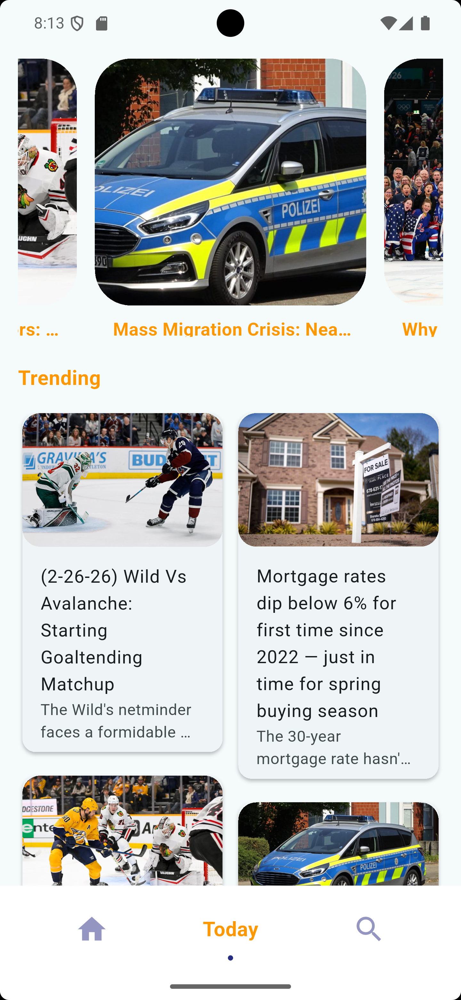
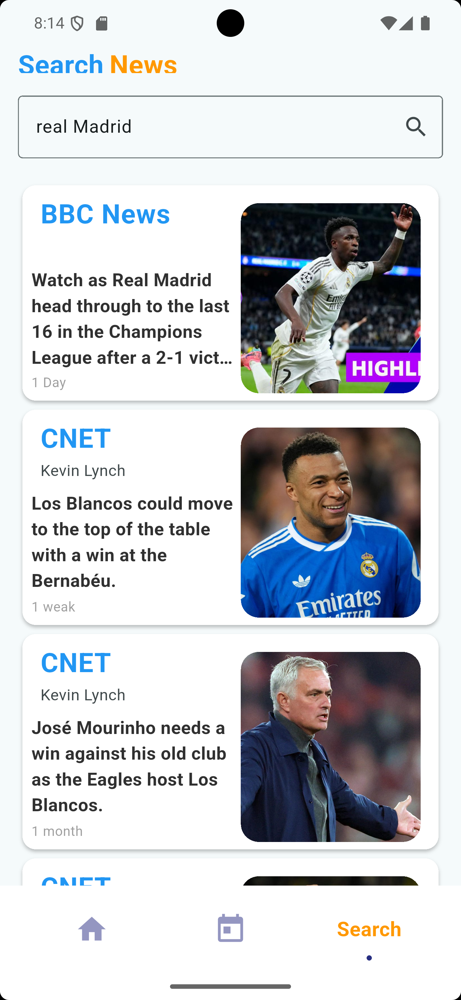

# 📰 News App — Flutter

A production-style **News Application** built with Flutter, following clean architecture principles and modern state management patterns.

---

## 📱 Screenshots

<table>
  <tr>
    <td align="center"><br/><b>Top Headlines</b></td>
    <td align="center"><br/><b>Today's Trending</b></td>
    <td align="center"><br/><b>Search</b></td>
    <td align="center"><br/><b>Article Details</b></td>
  </tr>
</table>

---

## ✨ Features

- 🗞️ Real-time news fetched via **RESTful APIs**
- 🧭 Smooth navigation with **GoRouter**
- 🎬 **Hero animations** for screen transitions
- 📜 Scrollable UI with **Sliver widgets**
- ⚙️ Scalable state management using **Cubit (Bloc)**
- 🖼️ Optimized **network image rendering**
- ✅ Proper **loading**, **error**, and **empty** state handling

---

## 🏗️ Architecture

This project follows **Clean Architecture** principles, separating the codebase into distinct layers:
```
lib/
├── core/               # Shared utilities, constants, theme
├── data/
│   ├── models/         # Data models / DTOs
│   ├── repositories/   # Repository implementations
│   └── sources/        # Remote data sources (API)
├── domain/
│   ├── entities/       # Business entities
│   ├── repositories/   # Repository interfaces
│   └── usecases/       # Application use cases
└── presentation/
    ├── cubits/         # Cubit state management
    ├── pages/          # Screens / Pages
    └── widgets/        # Reusable UI components
```

---

## 🛠️ Tech Stack

| Technology | Purpose |
|---|---|
| **Flutter** | UI Framework |
| **Dart** | Programming Language |
| **Cubit (flutter_bloc)** | State Management |
| **GoRouter** | Navigation & Routing |
| **Dio / http** | REST API Integration |
| **Cached Network Image** | Optimized Image Loading |
| **Hero Animations** | Screen Transition Effects |
| **Sliver Widgets** | Scrollable Layouts |

---

## 🚀 Getting Started

### Prerequisites

- Flutter SDK `>=3.0.0`
- Dart SDK `>=3.0.0`
- An API key from [NewsAPI.org](https://newsapi.org/) or your preferred news provider

### Installation
```bash
# 1. Clone the repository
git clone https://github.com/your-username/news-app-flutter.git

# 2. Navigate to the project directory
cd news-app-flutter

# 3. Install dependencies
flutter pub get

# 4. Add your API key
# Open lib/core/constants/api_constants.dart and add your key

# 5. Run the app
flutter run
```

---

## 🔑 API Configuration

Create a file at `lib/core/constants/api_constants.dart`:
```dart
class ApiConstants {
  static const String baseUrl = 'https://newsapi.org/v2';
  static const String apiKey = 'YOUR_API_KEY_HERE';
}
```

---

## 📦 Dependencies
```yaml
dependencies:
  flutter_bloc: ^8.1.3
  go_router: ^12.0.0
  dio: ^5.3.2
  equatable: ^2.0.5
  get_it: ^7.6.0
```

---

## 🤝 Contributing

Contributions are welcome! Feel free to open an issue or submit a pull request.

1. Fork the project
2. Create your feature branch: `git checkout -b feature/AmazingFeature`
3. Commit your changes: `git commit -m 'Add some AmazingFeature'`
4. Push to the branch: `git push origin feature/AmazingFeature`
5. Open a Pull Request

---

## 📄 License

This project is licensed under the MIT License — see the [LICENSE](LICENSE) file for details.

---

## 👨‍💻 Author

**Your Name**
- GitHub: [@your-username](https://github.com/your-username)
- LinkedIn: [your-linkedin](https://linkedin.com/in/your-linkedin)

---

<p align="center">Made with ❤️ using Flutter</p>
